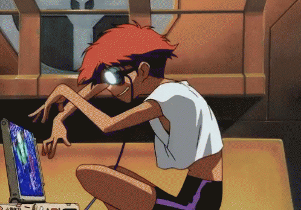

<h1 align= "center">  Hi, I'm Roschelle! </h1>

<p align= "center">Student - Video Editor - Software Developer</p>

### Who is Roschelle?



```python

class Roschelle:
    name = "Roschelle Matthews-Rhoden"
    uni = "The University of the West Indies"


```

### My Skillset

<p> </p>

[](https://skills.thijs.gg)

🌱 I’m currently learning ...
